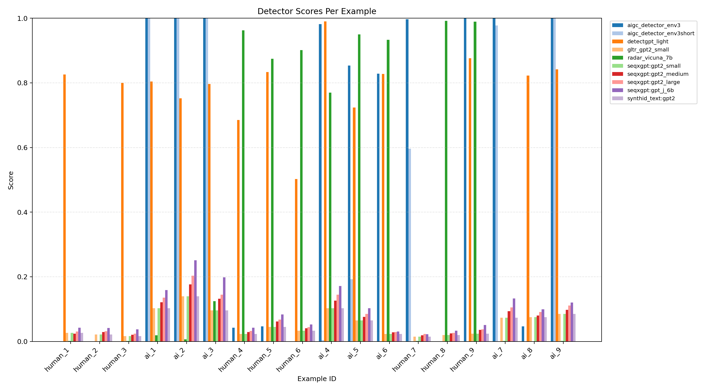

# Dokumentacja procesu

Ten plik dokumentuje **jak** pracowałem/am nad mini-projektem — jakie narzędzia AI wykorzystałem, jakie prompty pisałem, jakie decyzje podjąłem i co nie zadziałało.

> **PROCESS.md jest tak samo ważny jak kod.** Prowadzący ocenia świadome korzystanie z narzędzi AI — to jest kurs o aspektach AI.

---

## Narzędzia AI

[Lista narzędzi AI użytych w projekcie]

| Narzędzie | Do czego używałem |
|-----------|-------------------|
| np. Codex | Generowanie kodu projektu |
| np. ChatGPT | Brainstorm do pomysłów oraz wyszukiwanie informacji |

## Prompty

> Nie wklejaj outputu z AI — tylko prompty, które wpisywałeś/aś.

### [Kategoria 1, "Generowanie kodu"]

Projekt starałem się robić w oparciu o TDD red light, green light:
- Stworzyłem `AGENTS.md`, w którym zdefiniowałem, jak agenci do kodowania mają wykonywać swoją pracę — w postaci wykonywania tasków zawartych w `TASKS.md`:

```text
Task Files Policy
    TASKS.md is the active execution queue and planning board.
    FINISHED_TASKS.md is the immutable archive of completed tasks.
    Keep task IDs stable once assigned.
```

Do `TASKS.md` dodawałem stopniowo kolejne zadania, które miały być wykonane w ramach projektu. Każde zadanie było wykonywane w następujący sposób:

* spisywałem ogólny tekst zadania,
* instruowałem LLM, aby przeanalizował ze mną to zadanie, znalazł luki, dał swoje uwagi co do tego, czy ma jakieś braki, oraz podał alternatywy,
* modyfikowałem tekst zadania w oparciu o brainstorm, następnie instruowałem agenta, aby napisał testy do tego taska,
* patrzyłem na testy; jeżeli uznałem, że są okej, to kazałem LLM-owi wykonać task i upewnić się, że po jego wykonaniu testy przechodzą.

(Taka forma pracy miała zmniejszyć szanse na halucynacje modeli agentowych i „fakeowanie” rozwiązań).

Przykład taska (po brainstormie / doprecyzowaniach):

```text
Task 009 - dirty detector integration: AIGC Detector V3-Short

Scope:

    Add detector config and minimal runtime wiring for yuchuantian/AIGC_detector_env3short.
    Implement an adapter that subclasses/implements the shared detector abstraction from Task 012.
    Implement abstraction methods for this detector:
        single prediction: text -> float,
        batch prediction: batch -> batch[float],
        configured initialization flow.
    Add a smoke-run entry point that scores a small text file/jsonl sample and prints JSON outputs for quick manual validation.
    Keep integration intentionally minimal ("dirty"): no calibration, no advanced optimization, no experiment-matrix wiring yet.

Acceptance Criteria:

    Model loads and runs inference on GPU with 8GB VRAM (with safe low-memory defaults).
    Adapter implements the shared abstraction and returns stable float score outputs for single and batch methods.
    Smoke command runs end-to-end on at least 10 sample texts and saves outputs under runs/.
    Basic usage is documented in README.md.

Decision Notes:

    Chosen as first detector because checkpoint size is small (~499 MB) and should comfortably fit 8GB VRAM.
    Prioritize "works end-to-end" over correctness benchmarking in this task.

Test Plan:

    Add deterministic adapter tests for single/batch abstraction methods with mocked model outputs.
    Run one real smoke test on local sample texts and verify output artifact shape.
```

### [Kategoria 2, "Analiza wyników"]

Do tworzenia wizualizacji najpierw instruowałem Codexa, żeby na podstawie wyników stworzył mi dany typ wykresu (widziałem wyniki jako tekst, więc posiadałem „sanity check”, jak powinny wyglądać słupki itp.). Potem zwykle dawałem mu jeszcze 2–3 dodatkowe polecenia / wiadomości, bo w wykresach zawsze było coś niepasującego graficznie. Nawet jeżeli dopisało się w promcie, żeby wykres był „elegant” albo „clean looking, made with seaborn”, to agent okazał się mieć dość wątpliwe poczucie estetyki i trzeba było kazać mu pozmieniać rozmiary czcionek, kolory itp.

Muszę jednak przyznać, że tworzenie wykresów za pomocą agenta dość mocno rozleniwia, i potem wysyłałem do niego zapytania pokroju: „Hej Codex 5.3 high reasoning, spraw, aby słupek, który jest zielony, był jednak czerwony”.

### [Kategoria 3, "Vibe linux'owanie / docker'owanie"]

Chyba była to najbardziej owocnie wykorzystywana przeze mnie możliwość oferowana przez Codex — vibe-terminalowanie i vibe-dockerowanie. Bardzo często zamiast pisać jakieś komendy samemu albo budować obraz, odpalać kontener i uruchamiać w nim eksperymenty, pisałem w języku naturalnym, co chcę zrobić, a Codex sam wykonywał tak „zakolejkowane” akcje, czekał aż coś się skończy instalować i potem robił kolejną rzecz, którą wcześniej opisałem.

Chyba najwięcej wykorzystywałem to przy stawianiu modeli detektorów, bo bardzo często przy budowaniu obrazów z danym modelem wywalało mi jakiś błąd. Dzięki temu Codex automatycznie rozwiązywał te problemy, doprowadzał projekt do momentu, w którym model dało się uruchomić, i pisał streszczenie wszystkich „fixów”, które wykonał.

## Decyzje

1. **Architektura projektu** — miałem w głowie wizję szkieletu projektu i podziału na jego podfoldery, w tym wykorzystania dokeryzacji. Potem kierowałem Codexa tak, żeby przestrzegał tego podziału.
2. **Wybór modeli** — zapytałem Chata o polecenie modeli do detekcji tekstów, ale nie zaufałem mu na słowo i potem sprawdziłem dokładniej, co to są za modele i jak działają. Odfiltrowałem trochę „dziwnych poleceń”, np. model od Google, który ukrywa w tekście `SynthID` i je wykrywa, bo taki model nie miał za bardzo sensu w kontekście planu projektu.
3. **„Abstrakcje” w projekcie** — podjąłem decyzję o podstawowych abstrakcjach w projekcie, np. uniwersalnej abstrakcyjnej klasie detektora, i o tym, żeby implementacje poszczególnych detektorów były do niej dostosowane. Inaczej, gdybyśmy mieli używać każdego modelu detektora jako jego własnych funkcji, kod zmieniłby się w dość spore spaghetti.
4. **Narracja sprawozdania** — oglądając wstępne wyniki, sam wymyśliłem pytania badawcze i to, co zrobię, żeby na nie odpowiedzieć. Analizy wyników z Chatem były mało ciekawe i mało odkrywcze.
5. **Częsty sanity-check** — oprócz testów, które pisał mi Chat, podczas istotnych etapów projektu, w których wiele mogło zawieść, pisałem z Chatem „mini-skrypty”, które miały sprawdzić funkcjonalność tak, żebym naocznie zobaczył, że coś faktycznie działa (np. wiem dokładnie, jaki ma być wynik dla 100 próbek, czy model zwraca dokładnie takie wyniki, w dokładnie takiej formie, jak chcę, oraz czy zostało to zapisane do pliku tam, gdzie chcę).

[Ślepe uliczki, błędy, nieudane podejścia — to jest wartościowa część dokumentacji]

1. **Wstępne testy modeli i ich dopasowanie do abstrakcyjnej klasy** — na pewnym etapie projektu dałem agentowi zbyt dużą swobodę w dopisywaniu adapterów do modeli detekcyjnych i ich testowaniu.

Niektóre z modeli zwracały bardzo dziwne wyniki i wydawało się, że w ogóle nie działają. Aby to zdebugować, wyplotowałem sobie wyniki różnych uruchomionych detektorów:



Możemy zauważyć, że „zakres pewności” przypisywany tekstom znacząco różni się w zależności od modelu. Codex podczas dopasowywania modeli uznał, że pewność modelu >0.5 oznacza tekst AI, a poniżej tekst Human. Jest to po części prawda, ponieważ istnieje konwencja wskazywania tekstów Human jako pseudo-probability bliższych 0.0. Jednak z wykresu jasno widać, że każdy model wymaga innego progu i niezbędny jest pewien proces ich dostrajania — operują na innej skali.

2. **Pisanie zbyt dużych tasków** — zadowolony wstępnymi wynikami task-driven, test-driven development tworzyłem coraz obszerniejsze i bardziej ogólne zadania dla Codexa. W trakcie zauważyłem, że gdy „duży task” składa się ze zbyt dużej liczby kroków, agent wykonuje różnego rodzaju uproszczenia i trzeba kazać mu robić jedną atomową rzecz na raz. Brakowało mu „sanity checków” w przypadku takiego złożonego zadania.

3. **Kierunek projektu** — posiadałem mały plik txt, w którym zapisywałem sobie wszystkie rzeczy, które zostały jeszcze do zrobienia, i je odhaczałem. Gdzieś w połowie projektu zacząłem słuchać sugestii Codexa, co zrobić dalej, i zauważyłem po kilku godzinach, że wpadłem w pętlę pisania dużej ilości kodu, który w zasadzie nie posuwa mnie w ogóle do przodu. Zrobiłem więc cofnięcie się w historii Gita i później wszystko dalej trackowałem już samemu, zarządzając taskami.

## Iteracje

[Jak projekt ewoluował? Krótki opis kolejnych wersji / podejść]

1. Przygotowanie szkieletu projektu
2. Wybór datasetów + zaimplementowanie automatycznego pobierania danych
3. Wybór modeli
4. Pobranie i „pobawienie się” jednym modelem na próbkach datasetu
5. Dodanie metryk ewaluacji
6. Dodanie reszty modeli
7. Testy wszystkich modeli, zawężenie wykorzystanych modeli w projekcie do mniejszej próbki
8. Podział danych na treningowe i testowe splity + normalizacja
9. Przeliczenie wyników jako „wszystko ze wszystkim” (dobór thresholdu dla każdego modelu na każdym treningowym splicie i jego ewaluacja na testowych)
10. Wstępna wizualizacja wyników, sanity check
11. Przygotowanie wykresów pod konkretne pytania badawcze
12. Przygotowanie dodatkowego repozytorium do wygenerowania augmentowanych tekstów
13. Wizualizacje dla augmentowanych próbek
