# [Tytuł mini-projektu]

**Autor:** [Michał Rajkowski], nr indeksu: [248821]

**Temat:** [10] — [Detekcja treści generowanych przez AI]

**Kurs:** Aspekty prawne, społeczne i etyczne w AI, PWr 2025/2026

> Lista tematów: [Zasady zaliczenia — Menu mini-projektów](https://github.com/laugustyniak/ai-ethics-law-course/blob/main/Zasady%20zaliczenia.md#menu-mini-projekt%C3%B3w)

---

## Cel projektu

Porównanie dla topowych modeli detekcji AI:
- jaka jest ich skuteczność na zbiorach benchmarkowych (czy większe modele są dużo lepsze od mniejszych)
- czy dobór tekstów treningwych do wyznaczenia progów detekcji ma znaczący wpływ na działanie modeli
- jak różne techniki augmentacji tekstów wpływaja na wyniki tychże modeli

W tym celu postawiłem sobie trzy pytania badawcze:

- **Q1 - Czy dobór danych treningowych pod tuning progu pewności modeli ma znaczący wpływ na ewaluację?**

- **Q2 - Który detektor jest "najlepszy"? Czy są znaczące różnice w ich wynikach?**

- **Q3 - Jak augmentacje tekstów wpływają na detektory-AI?**

## Powiązanie z projektem grupowym

Projekt nie jest powiązany z projektem NW. Wybrałem go ponieważ zainteresował mnie sam temat i chciałem się o nim więcej dowiedzieć, szczególnie o tym jak dobre są detektory AI, które da się postawić lokalnie oraz jak augmentacje tekstu wpływają na ich działanie (czy da się łatwo oszukać te modele). 

## Wymagania

Repozytorium jest przygotowane pod uruchamianie eksperymentów głównie w Dockerze (GPU).

Minimalne wymagania:
- Linux + Docker + Docker Compose
- NVIDIA Driver + `nvidia-container-toolkit` (dla uruchamiania modeli na GPU)
- `git` z obsługą submodułów

Wymagania dodatkowe (tylko gdy chcesz uruchamiać coś lokalnie poza Dockerem):
- Python 3.10+ i `venv`
- zależności z `requirements.txt`
- dla notebooków: `requirements-notebooks.txt`

Inicjalizacja submodułów:

```bash
./scripts/init_submodules.sh
```

Konfiguracja zbioru Kaggle (opcjonalna):

```bash
mkdir -p .kaggle
cp configs/credentials/kaggle.example.json .kaggle/kaggle.json
chmod 600 .kaggle/kaggle.json
```

## Uruchomienie

Najprościej uruchamiać wszystko przez gotowe skrypty z `scripts/`.

1. Zbuduj obraz Docker:

```bash
make docker-build
# lub:
# HOST_UID="$(id -u)" HOST_GID="$(id -g)" HOST_USER="$(id -un)" docker compose build apm
```

2. (Opcjonalnie) Otwórz shell w kontenerze:

```bash
make docker-shell
```

3. Materializacja splitów train/test pod eksperymenty:

```bash
./scripts/run_global_local_pipeline.sh
```

4. Główne eksperymenty global/local (3 detektory: `aigc_detector_env3`, `seqxgpt:gpt2_medium`, `seqxgpt:gpt_j_6b`):

```bash
./scripts/run_global_local_experiments.sh
```

5. Postprocess (jeśli scoring się zakończył, ale metryki trzeba odtworzyć z `raw_scores.jsonl`):

```bash
./scripts/run_global_local_postprocess.sh runs/global_local_experiments/<run_id>/raw_scores.jsonl
```

6. Raporty Q1/Q2 (wykresy + tabele markdown/csv):

```bash
./scripts/run_global_local_q1_q2_report.sh --run-id <run_id>
```

7. Scenariusze augmentacji HC3 (Q3):

```bash
./scripts/run_augmented_hc3_materialize.sh
./scripts/run_augmented_hc3_analysis.sh --run-id <run_id>
./scripts/run_augmented_hc3_score_shift_report.sh --run-id <run_id>
./scripts/run_augmented_hc3_similarity_report.sh --run-id <run_id>
./scripts/run_augmented_hc3_jiwer_report.sh --run-id <run_id>
```


## Co zrobiono (krótki opis)

### **MODELE**

Wybrałem trzy modele do detekcji tekstów generowanych przez AI:
- `aigc_detector_env3` - `https://huggingface.co/yuchuantian/AIGC_detector_env3`
- `seqxgpt:gpt2_medium` - `https://huggingface.co/openai-community/gpt2-medium`
- `seqxgpt:gpt_j_6b` - `https://huggingface.co/EleutherAI/gpt-j-6b`

Wybrałem je bo miały różną liczbę parametrów (rozmiarem modelu) + różniły się sposobem detekcji.

### **DANE**

`Human ChatGPT Comparison Corpus` - `https://huggingface.co/datasets/Hello-SimpleAI/HC3`
`madlab-ucr/GriD` - `https://github.com/madlab-ucr/GriD`

Pierwotnie wybrałem 3 datasety, łącznie z jednym z Kaggle. Ale dataset kaggle okazał się mieć testy bardzo wysokiej jakości ale prawie wszystkie należały do jednej klasy, więc nie skorzystałem z niego w finalnych obliczeniach. 

Najlepszym zbiorem okazał się `HC3` ponieważ posiadał podział danych na dodatkowe kategorie (`finance`, `medicine`, `open_qa`, `reddit_eli5`, `wiki_csai`). 

### **EKSPERYMENTY**

Podzieliłem dane na split 50% train / 50% test. 
Dodatkowo zbiory train/test posiadały swoje osobne pod-splity ze względu na kategorię danych. 

Ze zbioru `hc3` uzyskano dla każdego splitu `train` i `test` po **842** (421 human, 421 ai) teksty dla każdej pod-kategorii. 

| Zbiór                   |              Train |               Test |
| ----------------------- | -----------------: | -----------------: |
| `hc3:all_train`         | 421 human + 421 ai | 421 human + 421 ai |
| `hc3:finance_train`     | 421 human + 421 ai | 421 human + 421 ai |
| `hc3:medicine_train`    | 421 human + 421 ai | 421 human + 421 ai |
| `hc3:open_qa_train`     | 421 human + 421 ai | 421 human + 421 ai |
| `hc3:reddit_eli5_train` | 421 human + 421 ai | 421 human + 421 ai |
| `hc3:wiki_csai_train`   | 421 human + 421 ai | 421 human + 421 ai |
| `grid:filtered`         |   50 human + 50 ai |   50 human + 50 ai |
| `grid:unfiltered`       |   50 human + 50 ai |   50 human + 50 ai |

Nastepnie przeprowadziłem eksperymenty z detekcją na tych danych.

#### Test modeli na różnych progach predykcji AI/HUMAN

Głównym celem było tunowanie tresholdu detektorów na całościowym zbiorze train oraz osobno na splitach pod-kategorii zbioru train, a nastepnie dla tych tresholdów dokonanie predykcji AI/HUMAN dla całościowego zbioru test oraz splitów zbioru test. W ten sposób mogliśmy sprawdzić:
- czy to na czym wybieramy treshold ma znaczenie
- jak bardzo wartość tresholdu wpływa na wyniki
- jak wyniki modeli różnią się międzysoba. 

#### Wpływ augmentacji na wyniki

Wysamplowano losowo dane ze zbioru HC aby otworzyć próbki train/test z podziałem na HUMAN/AI. Otrzymano:

|          | HUMAN |  AI |
| -------- | ----: | --: |
| HC_TRAIN |   100 | 100 |
| HC_TEST  |   100 | 100 |

Następnie dla tych próbek przeprowadzono za pomocą modelu `gpt-oss-20b` 5 rodzajów augmentacji generując nowe sztuczne dane zarówno dla HUMAN jak i AI. 

Wykonano 5 augmentacji tekstów

- `back_trans_pol_eng` - translacja tekstu na inny język i spowrotem (ENG -> Polish -> ENG)
- `back_trans_3langs` - back-translation tekstu przez 3 języki (EN -> Polish -> Spanish -> German -> EN)
- `back_trans_5langs` - back-translacja tekstu przez 5 języków (EN -> Polish -> Spanish -> German -> French -> Czech -> EN)
- `fewshot` - generowanie nowych tekstów metodą few-shot - dla każdej próbki wybierane są losowo trzy teksty i pokazywane jako przykłady. Następnie model ma stworzyć podobny do nich nowy tekst.
- `fix_ai_artifact` - na podstawie guidelines z wikipedii na temat detekcji tekstów AI model jest instruowany, żeby poprawićtekst i uniknąć wykrycia tych błędów. 
- `hasty` - model wprowadza do tekstu literówki i drobne błędy ortograficzne oraz zmienia szyk zdań tak aby tekst bardziej przypominał pisany przez człowieka. 

Odpowiednie prompty zamieszczono w `wyniki/PROMPTY_JINJA`.

Finalnie otrzymano nastepujące dane:

|                    | HUMAN |  AI |
| ------------------ | ----: | --: |
| HC_TRAIN |   100 | 100 |
| HC_TEST  |   100 | 100 |
| back_trans_3langs  |   100 | 100 |
| back_trans_5langs  |   100 | 100 |
| back_trans_pol_eng |   100 | 100 |
| fewshot            |   100 | 100 |
| fix_ai_artifact    |   100 | 100 |
| hasty              |   100 | 100 |

Następnie dokonano tuning modeli na zbiorze train, wyznaczono baseline-wyniki dla test oraz zmierzono jak z tresholdami z train modele poradziły sobie na augmentowanych tekstach. 

## Wyniki

### Q1 - Czy dobór danych treningowych pod tuning progu pewności modeli ma znaczący wpływ na ewaluację?

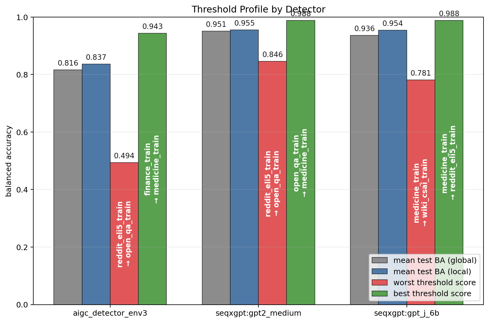


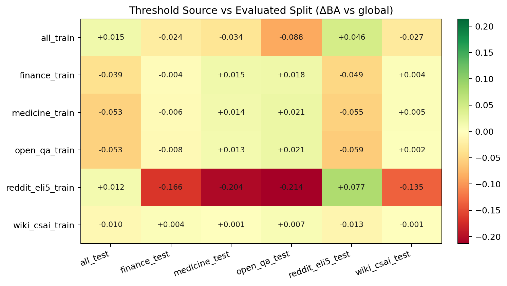
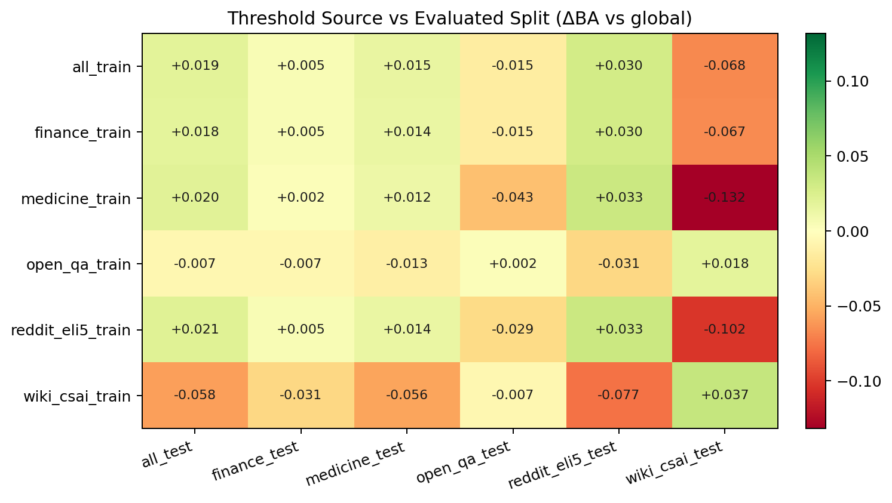
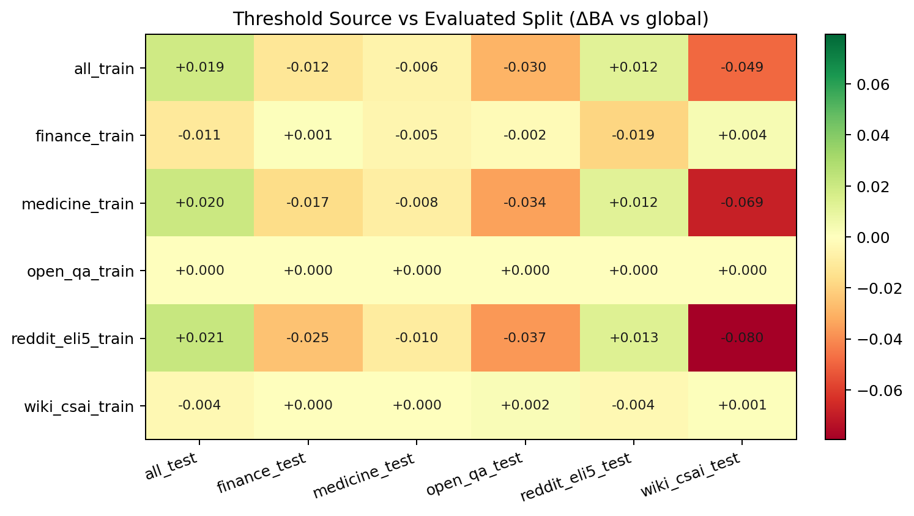


### Q2 - Który detektor jest "najlepszy"? Czy są znaczące różnice w ich wynikach?

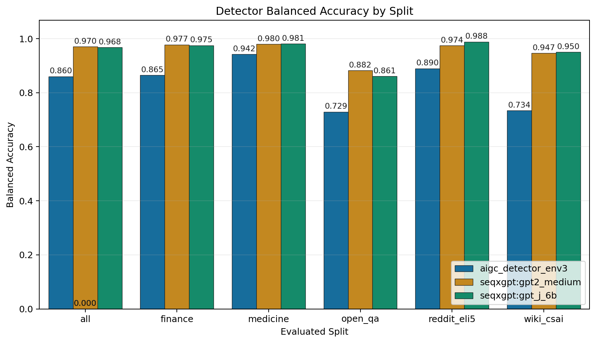
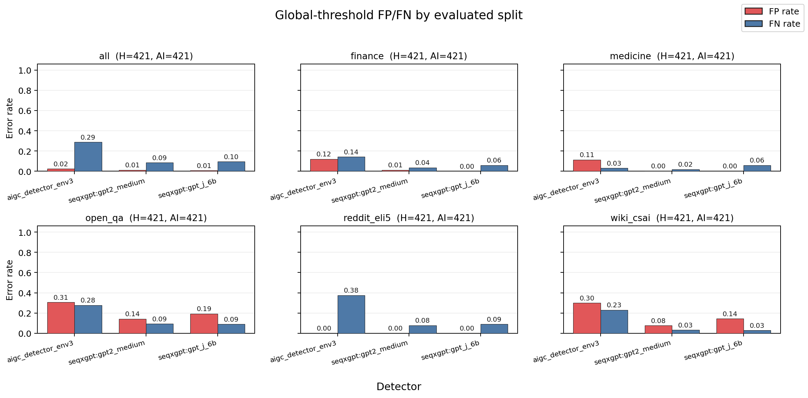


### Q3 - Jak augmentacje tekstów wpływają na detektory-AI?

Typy augmentacji

---

#### Podobieństwo tekstów syntaktyczne (WER / CER)

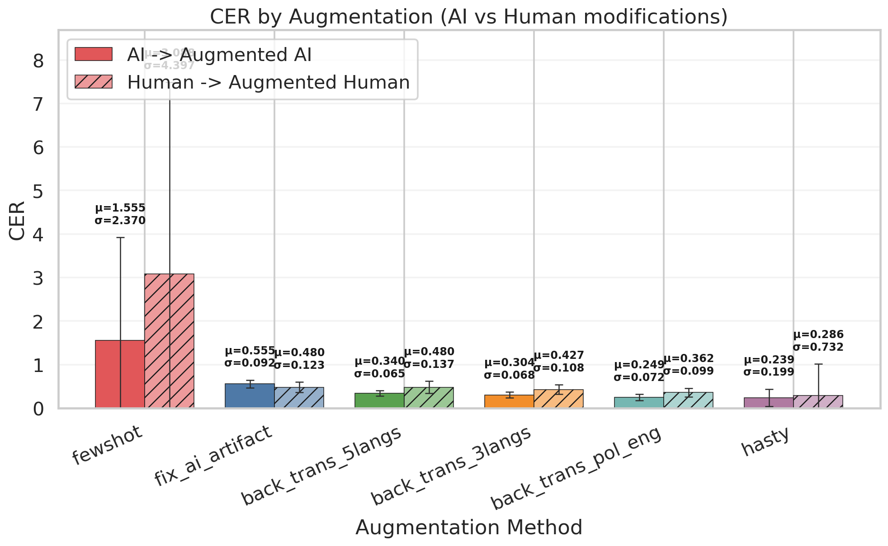

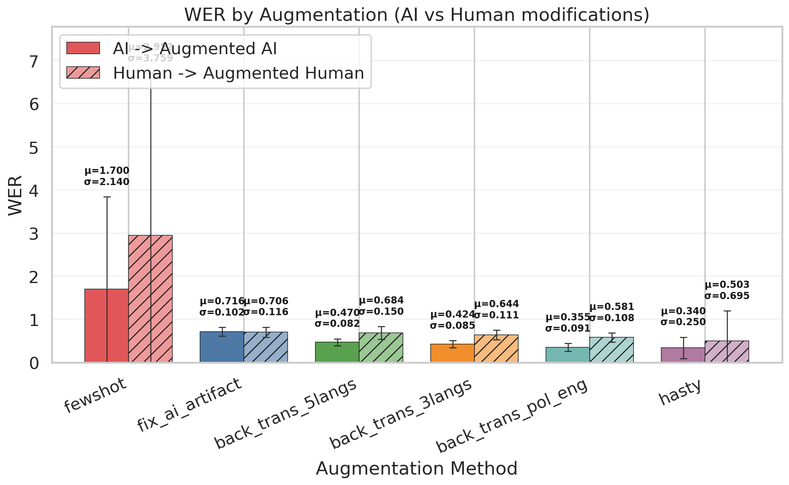

---

#### Podobieństwo tekstów semantyczne

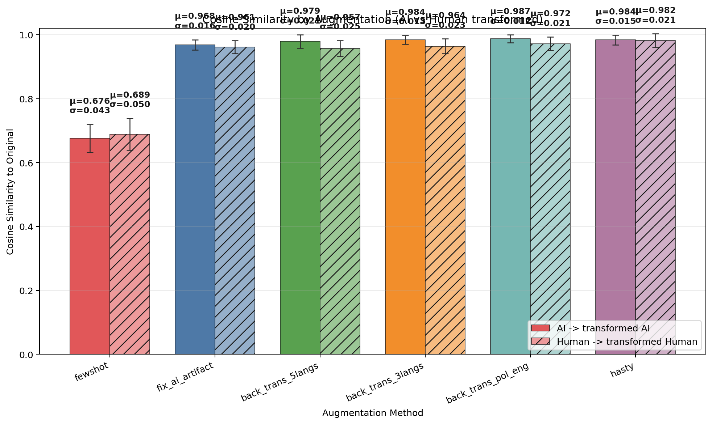

---

#### Wpływ augmentacji na wyniki modeli

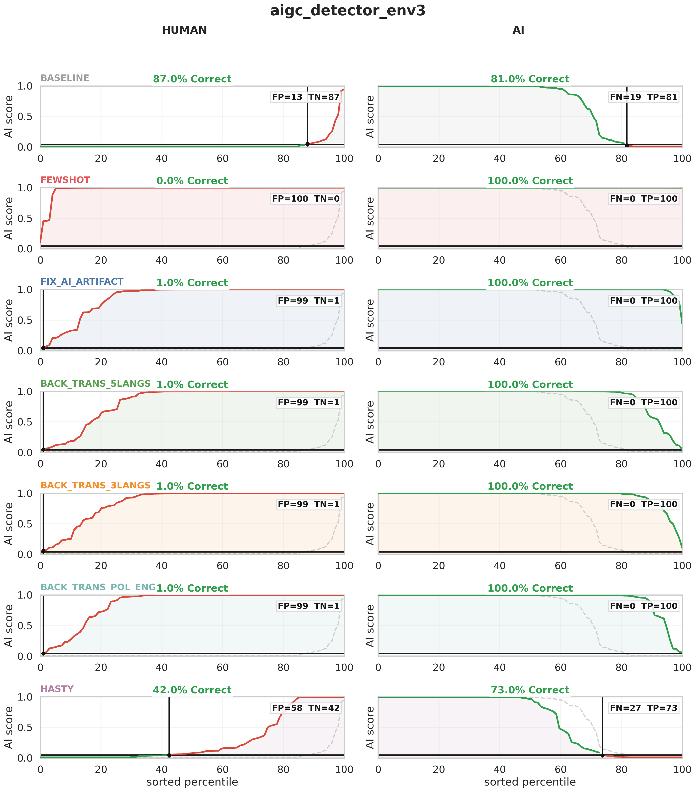

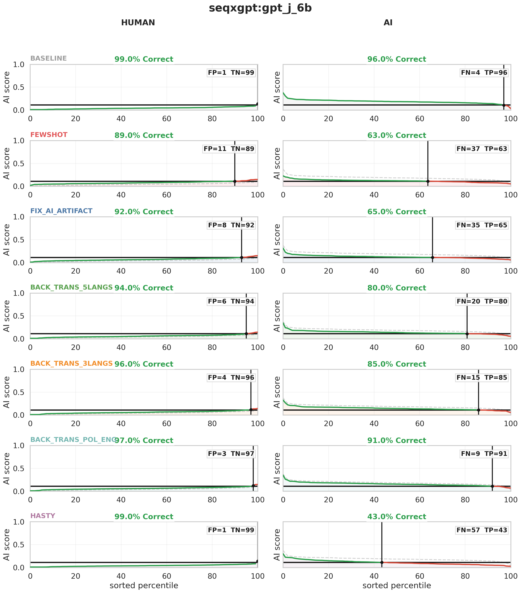

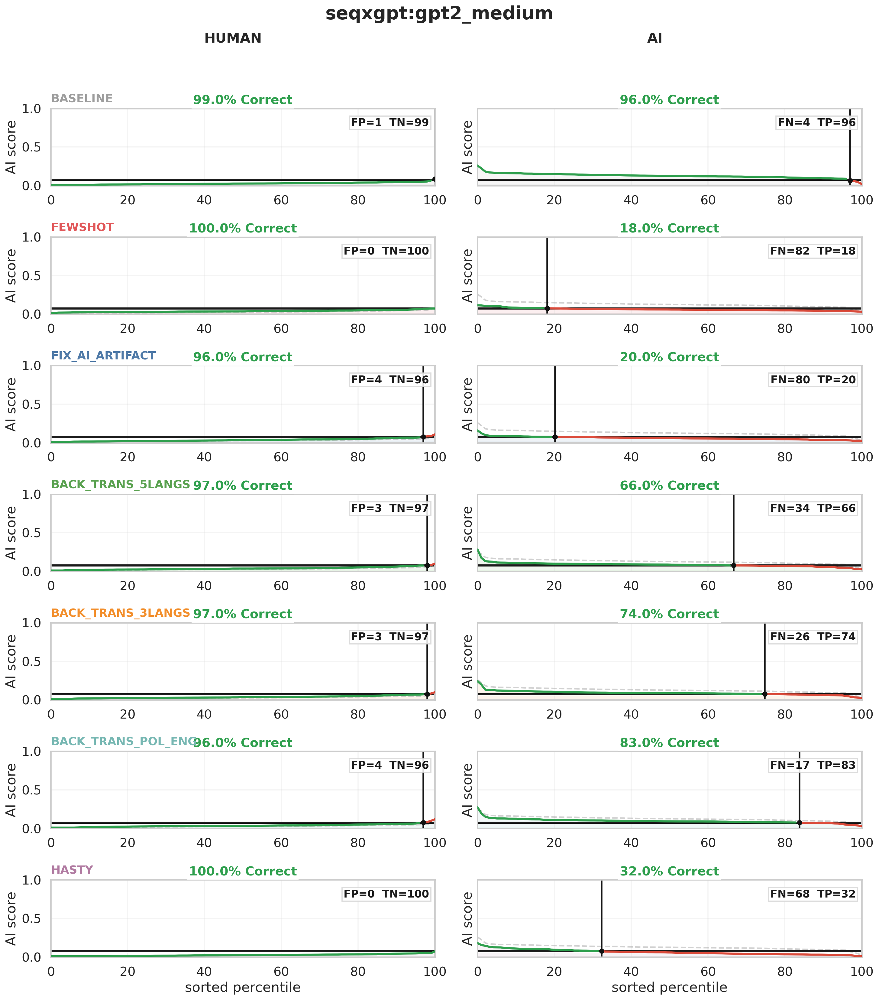


## Wnioski merytoryczne

[Kluczowa sekcja — co wynika z analizy w kontekście prawa / etyki / regulacji AI? Konkretne obserwacje i rekomendacje.]

## Ograniczenia

- Wybór modeli - Przetestowano małą liczbę modeli i nie były to modele duże. Sam wybór modeli był też troche przypadkowy i kierowałem się tym, które sprawdziły się dobrze na małej próbcę evaluacyjnej danych. 
- Augmentacje tekstów - wszystkie augmentacje zostały wykonane LLM'em. Projekt możnaby rozważyć o zmiany stworzone przez człowieka (np. napisanie tekstu własnymi słowami) i sprawdzenie czy bazująć na źródle AI samo przepisanie przez człowieka jest już wystarczające.
- Dobór tekstów - niestety wszystkie obliczenia bazowały pierwotnie na tekstach benchmarkowych. Zabrakło jakis autorskich tekstów, ale uznałem, że nie jestem w stanie w rozsądnym czasie sam wytworzyć takiej liczby próbek (100+ tekstów) aby wyniki były choć minimalnie miarodajne.
- W repozytorium zastosowano ekstremalny vibe-coding.

## Źródła

- [Nazwa źródła](URL) — krótki opis
