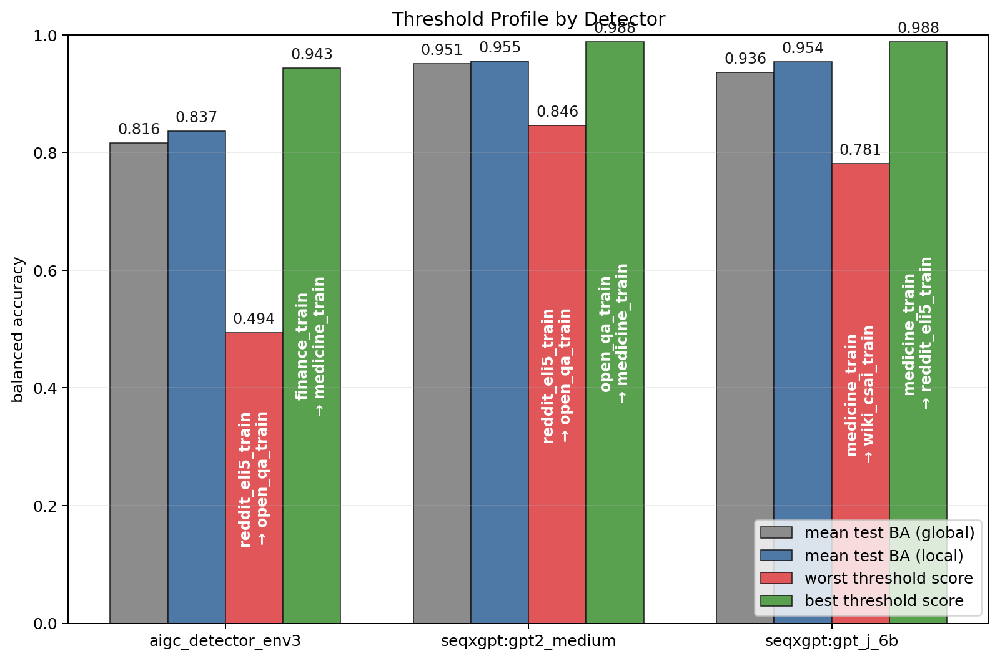
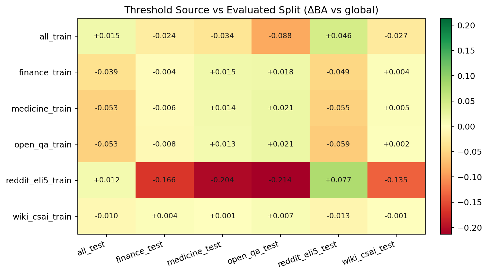
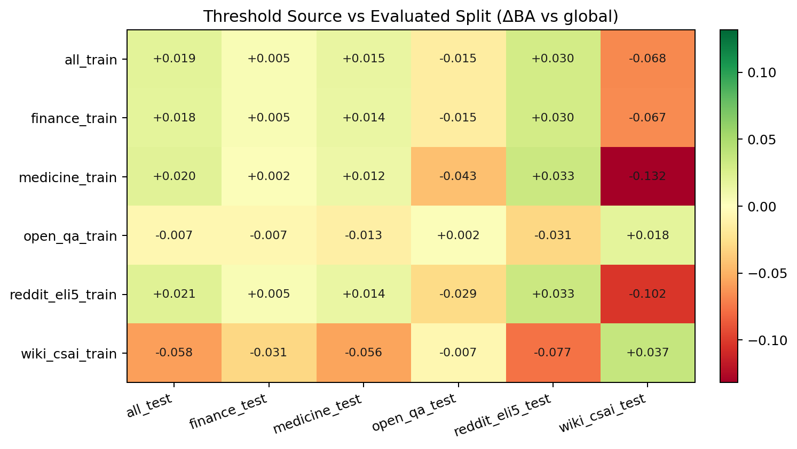
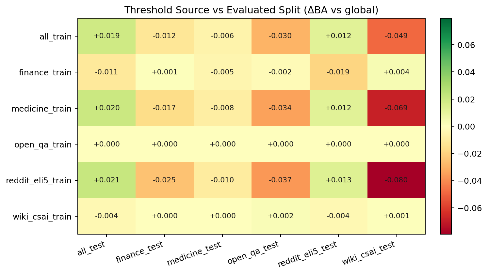
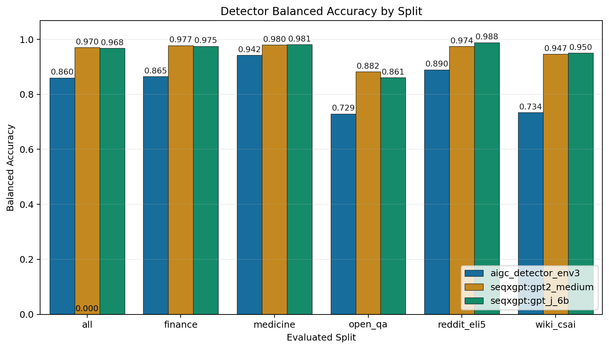
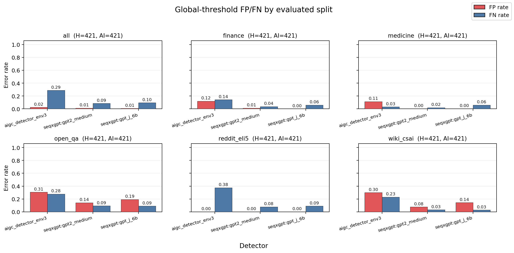
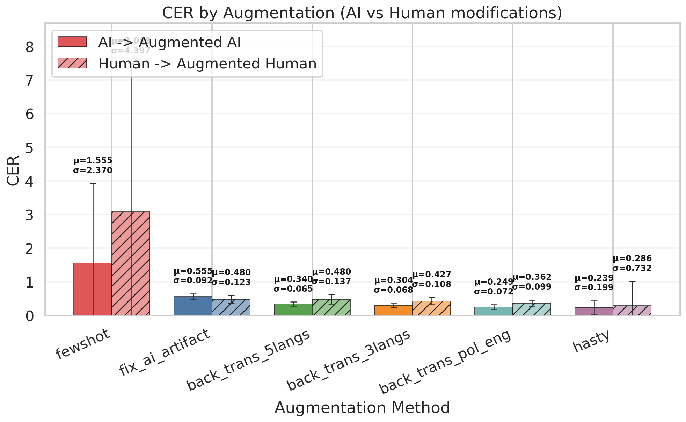
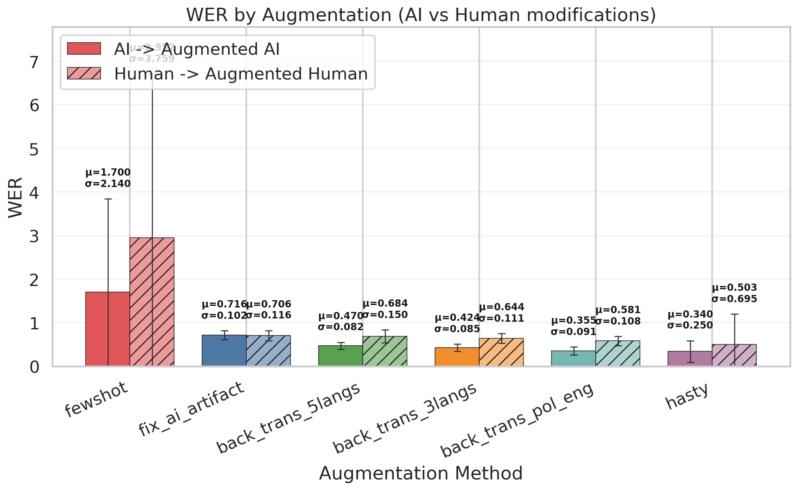
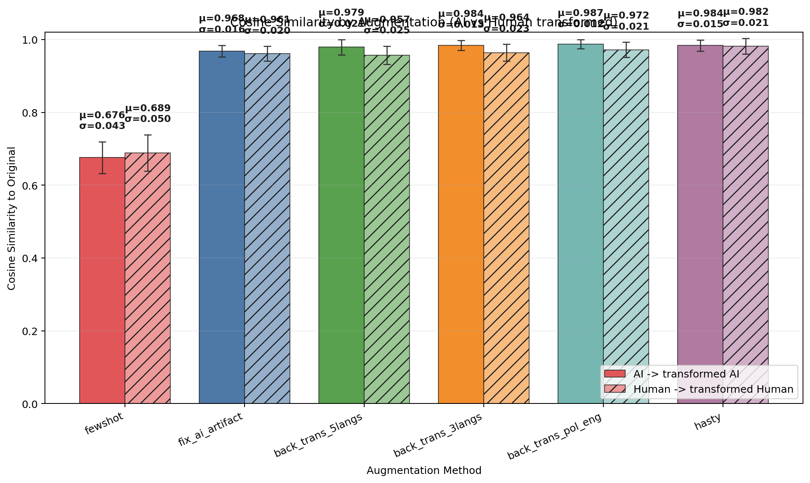
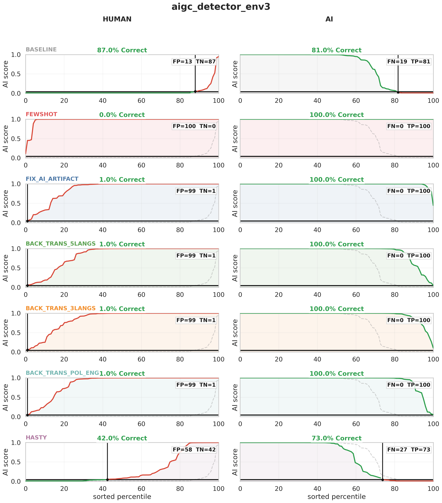

# [Detekcja treści generowanych przez AI]

**Autor:** [Michał Rajkowski], nr indeksu: [248821]

**Temat:** [10] - [Detekcja treści generowanych przez AI]

**Kurs:** Aspekty prawne, społeczne i etyczne w AI, PWr 2025/2026

> Lista tematów: [Zasady zaliczenia - Menu mini-projektów](https://github.com/laugustyniak/ai-ethics-law-course/blob/main/Zasady%20zaliczenia.md#menu-mini-projekt%C3%B3w)

---

## Cel projektu

Porównanie dla topowych modeli detekcji AI:
- jaka jest ich skuteczność na zbiorach benchmarkowych (czy większe modele są dużo lepsze od mniejszych)
- czy dobór tekstów treningwych do wyznaczenia progów detekcji ma znaczący wpływ na działanie modeli
- jak różne techniki augmentacji tekstów wpływaja na wyniki tychże modeli

W tym celu postawiłem sobie trzy pytania badawcze:

- **Q1 - Czy dobór danych treningowych pod tuning progu pewności modeli ma znaczący wpływ na ewaluację?**

- **Q2 - Który detektor jest "najlepszy"? Czy są znaczące różnice w ich wynikach?**

- **Q3 - Jak augmentacje tekstów wpływają na detektory-AI?**

## Powiązanie z projektem grupowym

Projekt nie jest powiązany z projektem NW. Wybrałem go ponieważ zainteresował mnie sam temat i chciałem się o nim więcej dowiedzieć, szczególnie o tym jak dobre są detektory AI, które da się postawić lokalnie oraz jak augmentacje tekstu wpływają na ich działanie (czy da się łatwo oszukać te modele). 

## Wymagania

Repozytorium jest przygotowane pod uruchamianie eksperymentów głównie w Dockerze (GPU).

Minimalne wymagania:
- Linux + Docker + Docker Compose
- NVIDIA Driver + `nvidia-container-toolkit` (dla uruchamiania modeli na GPU)
- `git` z obsługą submodułów

Wymagania dodatkowe (tylko gdy chcesz uruchamiać coś lokalnie poza Dockerem):
- Python 3.10+ i `venv`
- zależności z `requirements.txt`
- dla notebooków: `requirements-notebooks.txt`

Inicjalizacja submodułów:

```bash
./scripts/init_submodules.sh
```

Konfiguracja zbioru Kaggle (opcjonalna):

```bash
mkdir -p .kaggle
cp configs/credentials/kaggle.example.json .kaggle/kaggle.json
chmod 600 .kaggle/kaggle.json
```

## Uruchomienie

Najprościej uruchamiać wszystko przez gotowe skrypty z `scripts/`.

1. Zbuduj obraz Docker:

```bash
make docker-build
# lub:
# HOST_UID="$(id -u)" HOST_GID="$(id -g)" HOST_USER="$(id -un)" docker compose build apm
```

2. (Opcjonalnie) Otwórz shell w kontenerze:

```bash
make docker-shell
```

3. Materializacja splitów train/test pod eksperymenty:

```bash
./scripts/run_global_local_pipeline.sh
```

4. Główne eksperymenty global/local (3 detektory: `aigc_detector_env3`, `seqxgpt:gpt2_medium`, `seqxgpt:gpt_j_6b`):

```bash
./scripts/run_global_local_experiments.sh
```

5. Postprocess (jeśli scoring się zakończył, ale metryki trzeba odtworzyć z `raw_scores.jsonl`):

```bash
./scripts/run_global_local_postprocess.sh runs/global_local_experiments/<run_id>/raw_scores.jsonl
```

6. Raporty Q1/Q2 (wykresy + tabele markdown/csv):

```bash
./scripts/run_global_local_q1_q2_report.sh --run-id <run_id>
```

7. Scenariusze augmentacji HC3 (Q3):

```bash
./scripts/run_augmented_hc3_materialize.sh
./scripts/run_augmented_hc3_analysis.sh --run-id <run_id>
./scripts/run_augmented_hc3_score_shift_report.sh --run-id <run_id>
./scripts/run_augmented_hc3_similarity_report.sh --run-id <run_id>
./scripts/run_augmented_hc3_jiwer_report.sh --run-id <run_id>
```


## Co zrobiono (krótki opis)

### **MODELE**

Wybrałem trzy modele do detekcji tekstów generowanych przez AI:
- `aigc_detector_env3` - `https://huggingface.co/yuchuantian/AIGC_detector_env3`
- `seqxgpt:gpt2_medium` - `https://huggingface.co/openai-community/gpt2-medium`
- `seqxgpt:gpt_j_6b` - `https://huggingface.co/EleutherAI/gpt-j-6b`

Wybrałem je bo miały różną liczbę parametrów (rozmiarem modelu) + różniły się sposobem detekcji.

### **DANE**

`Human ChatGPT Comparison Corpus` - `https://huggingface.co/datasets/Hello-SimpleAI/HC3`
`madlab-ucr/GriD` - `https://github.com/madlab-ucr/GriD`

Pierwotnie wybrałem 3 datasety, łącznie z jednym z Kaggle. Ale dataset kaggle okazał się mieć testy bardzo wysokiej jakości ale prawie wszystkie należały do jednej klasy, więc nie skorzystałem z niego w finalnych obliczeniach. 

Najlepszym zbiorem okazał się `HC3` ponieważ posiadał podział danych na dodatkowe kategorie (`finance`, `medicine`, `open_qa`, `reddit_eli5`, `wiki_csai`). 

### **EKSPERYMENTY**

Podzieliłem dane na split 50% train / 50% test. 
Dodatkowo zbiory train/test posiadały swoje osobne pod-splity ze względu na kategorię danych. 

Ze zbioru `hc3` uzyskano dla każdego splitu `train` i `test` po **842** (421 human, 421 ai) teksty dla każdej pod-kategorii. 

| Zbiór                   |              Train |               Test |
| ----------------------- | -----------------: | -----------------: |
| `hc3:all_train`         | 421 human + 421 ai | 421 human + 421 ai |
| `hc3:finance_train`     | 421 human + 421 ai | 421 human + 421 ai |
| `hc3:medicine_train`    | 421 human + 421 ai | 421 human + 421 ai |
| `hc3:open_qa_train`     | 421 human + 421 ai | 421 human + 421 ai |
| `hc3:reddit_eli5_train` | 421 human + 421 ai | 421 human + 421 ai |
| `hc3:wiki_csai_train`   | 421 human + 421 ai | 421 human + 421 ai |
| `grid:filtered`         |   50 human + 50 ai |   50 human + 50 ai |
| `grid:unfiltered`       |   50 human + 50 ai |   50 human + 50 ai |

Nastepnie przeprowadziłem eksperymenty z detekcją na tych danych.

#### Test modeli na różnych progach predykcji AI/HUMAN

Głównym celem było tunowanie tresholdu detektorów na całościowym zbiorze train oraz osobno na splitach pod-kategorii zbioru train, a nastepnie dla tych tresholdów dokonanie predykcji AI/HUMAN dla całościowego zbioru test oraz splitów zbioru test. W ten sposób mogliśmy sprawdzić:
- czy to na czym wybieramy treshold ma znaczenie
- jak bardzo wartość tresholdu wpływa na wyniki
- jak wyniki modeli różnią się międzysoba. 

#### Wpływ augmentacji na wyniki

Wysamplowano losowo dane ze zbioru HC aby otworzyć próbki train/test z podziałem na HUMAN/AI. Otrzymano:

|          | HUMAN |  AI |
| -------- | ----: | --: |
| HC_TRAIN |   100 | 100 |
| HC_TEST  |   100 | 100 |

Następnie dla tych próbek przeprowadzono za pomocą modelu `gpt-oss-20b` 5 rodzajów augmentacji generując nowe sztuczne dane zarówno dla HUMAN jak i AI. 

Wykonano 6 augmentacji tekstów:

- `back_trans_pol_eng` - translacja tekstu na inny język i spowrotem (ENG -> Polish -> ENG)
- `back_trans_3langs` - back-translation tekstu przez 3 języki (EN -> Polish -> Spanish -> German -> EN)
- `back_trans_5langs` - back-translacja tekstu przez 5 języków (EN -> Polish -> Spanish -> German -> French -> Czech -> EN)
- `fewshot` - generowanie nowych tekstów metodą few-shot - dla każdej próbki wybierane są losowo trzy teksty i pokazywane jako przykłady. Następnie model ma stworzyć podobny do nich nowy tekst.
- `fix_ai_artifact` - na podstawie guidelines z wikipedii na temat detekcji tekstów AI model jest instruowany, żeby poprawićtekst i uniknąć wykrycia tych błędów. 
- `hasty` - model wprowadza do tekstu literówki i drobne błędy ortograficzne oraz zmienia szyk zdań tak aby tekst bardziej przypominał pisany przez człowieka. 

Odpowiednie prompty zamieszczono w `wyniki/PROMPTY_JINJA`.

Finalnie otrzymano nastepujące dane:

|                    | HUMAN |  AI |
| ------------------ | ----: | --: |
| HC_TRAIN |   100 | 100 |
| HC_TEST  |   100 | 100 |
| back_trans_3langs  |   100 | 100 |
| back_trans_5langs  |   100 | 100 |
| back_trans_pol_eng |   100 | 100 |
| fewshot            |   100 | 100 |
| fix_ai_artifact    |   100 | 100 |
| hasty              |   100 | 100 |

Następnie dokonano tuning modeli na zbiorze train, wyznaczono baseline-wyniki dla test oraz zmierzono jak z tresholdami z train modele poradziły sobie na augmentowanych tekstach. 

## Wyniki

### Q1 - Czy dobór danych treningowych pod tuning progu pewności modeli ma znaczący wpływ na ewaluację?



Wykres słupkowy przedstawia wpływ doboru progu decyzyjnego (**threshold**) modeli na końcowe wyniki klasyfikacji na zbiorze testowym. Zbadano różne kombinacje składu zbiorów treningowych i testowych, tj. to, jakie splity `hc3` były w nich zawarte, a wyniki przedstawiono w postaci słupków w czterech kolorach, odpowiadających wartościom **Balanced Accuracy** modeli w zależności od zawartości zbiorów:

- **szary** - model trenowany na zbiorze mieszanym zawierającym dane ze wszystkich 5 splitów i ewaluowany na mieszanym zbiorze testowym, również obejmującym 5 splitów,
- **niebieski** - model trenowany na danych pochodzących tylko z jednego splitu, a następnie ewaluowany na danych testowych z tego samego splitu (wynik przedstawia średnią wartość **BA** z ewaluacji na 5 splitach),
- **czerwony** (**przypadek pesymistyczny**) - model był trenowany na jednym splicie, a testowany na innym; jest to najgorszy możliwy scenariusz, w którym trening na różniącym się źródle danych prowadził do największej degradacji wyniku,
- **zielony** (**przypadek optymistyczny**) - model był trenowany i testowany na danych z różnych splitów; jest to najlepszy możliwy scenariusz, w którym wybór odpowiedniego zbioru treningowego zapewnił najwyższy wynik ewaluacyjny.

Porównując słupek szary z niebieskim, można jednoznacznie zauważyć, że trening i ewaluacja na danych z tej samej domeny prowadzą do poprawy jakości predykcji w porównaniu z danymi, których rozkład obejmuje szerszy zakres tematyczny, choć poprawa **BA** waha się jedynie między 0,5% a 2%. Widzimy także, na podstawie słupka czerwonego, że nieodpowiedni dobór danych treningowych prowadzi do znacznej degradacji wyników na zbiorze testowym.

Porównując spadek czerwonego słupka względem niebieskiego pomiędzy modelami, można również zauważyć, że `aigc_detector` jest znacznie mniej odporny na dobór wartości progu predykcji niż modele `seqxgpt`.

---

Poniżej zamieszczono trzy wykresy typu confusion matrix, pokazujące, jak wyznaczenie progu predykcji modeli na 5 różnych splitach danych (`finance`, `medicine`, `open_qa`, `reddit_eli5`, `wiki_csai`) oraz na zbiorze mieszanym, zawierającym próbki ze wszystkich splitów, wpływa na wynik ewaluacji na 5 różnych splitach danych testowych. Wartość w poszczególnych polach odpowiada zmianie wartości **Balanced Accuracy** względem wartości bazowej, otrzymanej przy doborze progu na większej próbce mieszanych danych.

Analizując wykresy, można zauważyć, że zmiany wyników dla większości progów przypominają szum, tzn. obserwowane są jedynie niewielkie wahania rzędu kilku procent. Jedynym zbiorem, który wyraźnie się wyróżnia, jest `reddit_eli5_train`. Można zauważyć, że dobór progu na podstawie tego zbioru (w przypadku wykresu `aigc_detector`) doprowadził do znacznej poprawy ewaluacji na splicie `reddit_eli5_test`, a jednocześnie do istotnego spadku wyników ewaluacji na wszystkich niemieszanych splitach testowych. Co ciekawe, poprawa uzyskana na zbiorze `eli5_test` jest mniej więcej równoważona przez spadki na pozostałych splitach, w wyniku czego na zbiorze mieszanym `all_test` wynik różni się jedynie o około 1 punkt procentowy.

Zjawisko to można wyjaśnić wyraźnie odmiennym charakterem tekstów `eli5` względem pozostałych zbiorów. Teksty `eli5` wydają się bardziej emocjonalne i chaotyczne, przez co średni próg pewności modelu dobrany na tym zbiorze okazuje się mało reprezentatywny dla tekstów o bardziej technicznej tematyce, takich jak odpowiedzi finansowe czy medyczne.

##### aigc_detector



##### seqxgpt_gpt_j_6b



##### eqxgpt_gpt2_medium


### Q2 - Który detektor jest "najlepszy"? Czy są znaczące różnice w ich wynikach?



Wykres przedstawia detektory z dobranymi podczas treningu najlepszymi progami decyzyjnymi oraz zestawienie wartości **Balanced Accuracy** ich predykcji na poszczególnych zbiorach testowych.

Możemy zauważyć, że detektory `seqxgpt` uzyskiwały lepsze wyniki niż detektor `aigc_detector` dla każdego podzbioru danych, a różnica była znacząca (ponad 10 punktów procentowych), przez co można uznać ten typ detektora za obiektywnie lepszy dla rozważanego problemu.

Co ciekawe, w ramach eksperymentów okazało się, że większy model niekoniecznie oznacza model „dużo lepszy”. Jeśli spojrzymy na liczbę parametrów modeli (`aigc_detector_env3` - 125M, `seqxgpt:gpt2_medium` - 355M, `seqxgpt:gpt_j_6b` - 6.05B), można zauważyć, że model `gpt2`, będący około 20 razy mniejszy od `gpt_j_6b`, osiągał wyniki porównywalne do wspomnianego większego modelu.

---

Oprócz samej wartości **Balanced Accuracy** modeli, przyjrzałem się także temu, jakiego typu błędy popełniają wspomniane modele, i zestawiłem je w zależności od zbioru ewaluacyjnego. Dla analizowanych danych:

- **False Positive (FP)** - tekst `human`, model przewidział `ai`
- **False Negative (FN)** - tekst `ai`, model przewidział `human`

Z wykresów można zauważyć, że modele ewaluowane na zbiorze mieszanym popełniają znacznie więcej błędów typu **FN** niż **FP**. Oznacza to, że częściej dają się „oszukać” przez teksty sztuczne, niż błędnie oceniają teksty ludzkie jako wygenerowane przez AI. Ta dysproporcja prowadzi do ciekawej obserwacji, ponieważ progi zostały dobrane tak, aby modele osiągały jak najwyższe **Balanced Accuracy**. Oznacza to, że zmiana progu prowadząca do obniżenia liczby błędów **FN** musiałaby jednocześnie na tyle zwiększyć liczbę błędów **FP**, że z punktu widzenia tej metryki model „uznawał” ją za nieopłacalną.

Wyniki wskazały także interesujący kierunek dalszych eksperymentów. Dla niektórych zbiorów tekstów, takich jak `wiki_csai` oraz `open_qa`, modele znacznie częściej błędnie klasyfikują teksty ludzkie jako `ai`, natomiast dla zbioru `reddit_eli5` teksty `ai` są częściej przewidywane jako `human`. Na podstawie dokładniejszej analizy zawartości i formy tych tekstów interesujące byłoby sprawdzenie, co dokładnie wpłynęło na takie wyniki, tj. jakie cechy sprawiły, że model popełniał tego typu błędy. Jednak ze względu na i tak rozszerzający się scope mini-projektu postanowiłem nie zagłębiać się dalej w to zagadnienie.



### Q3 - Jak augmentacje tekstów wpływają na detektory-AI?

Wykonano 6 typów augmentacji tekstów:

- `back_trans_pol_eng` - translacja tekstu na inny język i z powrotem (`ENG -> Polish -> ENG`),
- `back_trans_3langs` - back-translation tekstu przez 3 języki (`EN -> Polish -> Spanish -> German -> EN`),
- `back_trans_5langs` - back-translation tekstu przez 5 języków (`EN -> Polish -> Spanish -> German -> French -> Czech -> EN`),
- `fewshot` - generowanie nowych tekstów metodą few-shot; dla każdej próbki losowo wybierane są trzy teksty i prezentowane jako przykłady, a następnie model tworzy nowy tekst podobny do nich,
- `fix_ai_artifact` - na podstawie guidelines z Wikipedii dotyczących detekcji tekstów AI model jest instruowany, aby poprawić tekst i uniknąć cech mogących ułatwiać jego wykrycie,
- `hasty` - model wprowadza do tekstu literówki, drobne błędy ortograficzne oraz zmienia szyk zdań, tak aby tekst bardziej przypominał tekst pisany przez człowieka.

Najpierw, za pomocą odległości edycyjnych **WER/CER** oraz podobieństwa semantycznego, zbadałem, czy teksty powstałe w wyniku augmentacji faktycznie różnią się na poziomie zapisu, przy jednoczesnym zachowaniu tego samego tematu i znaczenia.

---

#### Podobieństwo tekstów syntaktyczne (WER / CER)





Do interpretacji wyników **CER/WER** należy najpierw zrozumieć, w jaki sposób obliczane są te metryki oraz co oznacza sytuacja, w której np. **CER = 2**:

```text
CER/WER = (S + D + I) / N

gdzie:
- S = substitutions
- D = deletions
- I = insertions
- N = liczba znaków (CER) lub słów (WER) w tekście referencyjnym
```

Możemy zauważyć, że jedynie `fewshot` osiąga wartości **CER/WER > 1**, co jest dobrym znakiem - tylko generowanie nowych tekstów na bazie kilku przykładów prowadzi do powstania tekstu bardzo mało podobnego pod względem zapisu do oryginału. Dla pozostałych augmentacji wyniki oscylują w przedziale `0–0.5`, co wskazuje na stosunkowo duże modyfikacje, ale jednocześnie takie, które zachowują część słów wykorzystanych w oryginalnych tekstach.

Do ciekawszych obserwacji należą:

- słupki błędów dla `fewshot` są bardzo duże - nie jest to błąd. W sytuacji, gdy na wejściu pojawiał się bardzo krótki tekst, a w wyniku augmentacji `fewshot` powstawał tekst znacznie dłuższy, odległość edycyjna mogła przyjmować bardzo wysokie wartości, głównie ze względu na samą różnicę długości tekstów,
- back-translacje modyfikują tekst znacznie bardziej wtedy, gdy na wejściu znajduje się tekst napisany przez człowieka - prawdopodobnie dlatego, że w procesie tłumaczenia zanikają ludzkie błędy i charakterystyczne naleciałości językowe; model tłumaczący mógł np. automatycznie poprawiać literówki, ponieważ prompt nie zawierał informacji o konieczności ich zachowania,
- augmentacje okazują się bardziej dotkliwe dla tekstów `human` niż dla tekstów `ai`.

---

#### Podobieństwo tekstów semantyczne



Osadzając teksty oryginalne oraz teksty po augmentacji za pomocą modelu `BAAI/bge-m3` i obliczając podobieństwo cosinusowe między wektorami reprezentacji, sprawdziłem, w jakim stopniu augmentacja wpływa na semantykę tekstów.

Podobieństwo między tekstem źródłowym a tekstem po augmentacji pozostaje bardzo wysokie i dla większości metod wynosi niemal `1.00` (około `0.96–0.98`). Wyjątek stanowi augmentacja `fewshot`, dla której różnice semantyczne są wyraźnie większe.

Do ciekawszych obserwacji należą:

- teksty ludzkie po augmentacji wykazują większy spadek podobieństwa niż teksty `ai`,
- im więcej języków obejmuje back-translacja, tym większy jest spadek podobieństwa między tekstem źródłowym a wynikowym, co pokazuje, że tłumaczenie nie jest procesem idealnie zachowującym znaczenie 😄,
- edycje `hasty` powodują najmniejsze różnice semantyczne i są jedynym rodzajem augmentacji, dla którego wyniki dla tekstów `ai` i `human` są porównywalne; można więc uznać, że wprowadzanie literówek i drobnych zmian formalnych jest najmniej inwazyjne z punktu widzenia znaczenia treści.

---

#### Wpływ augmentacji na wyniki modeli

Ta część sprawozdania posiada najbardziej "szalone" wykresy i wymagają pewnego komentarza co w ogóle przedstawiają. 

Poniżej będą przedstawione 3 zbiory wykresów (po 1 na każdy model) które wizualizują, jak bardzo model pewien jest, że dane próbki są tekstem `ai`, i każdy podwykres jest "posortowanymi" predykcjami dla 100 próbek każdy, oraz wygładzone tak aby przypominały linię. Pierwsze dwa podwykresy BASELINE pokazują, jak wyglądają predykcje i pewność modelu dla próbek samych HUMAN oraz samych AI. Zielona linia oznacza predykcję poprawną dla danej próbki, czerwona oznacza predykcję błędną. Pionowa kreska pokazuje punkt "przegięcia" i możemy za jej pomocą zobaczyć "na oko" liczbę próbek (proporcje) dla których model wykonał poprawne przewidywanie oraz złe (+ na tej lini zawsze napisano liczbę poprawnych i błędnych klasyfikacji). 

Poniżej wykresów BASELINE, pokazane są predykcje modelu dla zmodyfikowanych próbek na bazie próbek źródłowych (zależnie od kolumny HUMAN lub AI). Dzięki temu możemy zobaczyć nie tylko jak zmienia się wynik klasyfikacj, ale też jak zmienia się pewność modelu co do tych próbek (np jeżeli byłby "skokowy" to istnieje dużo próbek które wyglądają bardzo sztucznie i bardzo "human" i jest mało takich które są dla modelu "niepewne/pomiędzy", natomiast gładszy przebieg lini wskazywałby, że model posiada dużo szerszą gammę "pewności" do widzanych tekstów). Dodatkowo dla każdego wykresu innego niż BASELINE zaznaczone jest szarą przerywaną linią krzywa wcześniejszych pewności modelu. 



Analizując wyniki modelu `aigc_detector`, można zauważyć kilka istotnych obserwacji:

- wszystkie edycje tekstów ludzkich pogarszają wyniki, co oznacza, że edytowanie tekstu napisanego przez człowieka za pomocą LLM-a nie sprawia, że staje się on „bardziej ludzki” z perspektywy modelu,
- najmniej inwazyjną edycją tekstów ludzkich okazało się wprowadzenie celowych literówek i błędów, jednak nawet wtedy model oceniał taki tekst jako bardziej „AI-generated”,
- dla tekstów `AI` udało się znaleźć augmentację, która częściowo oszukuje model — wprowadzenie literówek obniżyło skuteczność klasyfikacji, przez co więcej próbek „przekradło się” jako `human`, mimo że w rzeczywistości były wygenerowane przez AI,
- zaskakujący jest wynik uzyskany dla augmentacji `FIX_AI_ARTIFACT` — model, otrzymując prompt instruujący go, jak usunąć typowe artefakty tekstów AI, wygenerował teksty, które okazały się jeszcze łatwiejsze do wykrycia jako sztuczne. Co więcej, model był co do ich sztuczności nawet bardziej pewien niż w przypadku wielokrotnych back-translacji.
## Wnioski merytoryczne

1. Rozmiar modelu wykrywającego tekst AI nie ma aż tak dużego znaczenia; znacznie ważniejszy okazał się odpowiedni dobór tekstów, na podstawie których dostrajane są jego parametry.

2. Dostrajanie progu decyzyjnego na zbiorze treningowym, którego teksty znacząco różnią się formą od tekstów, na których model będzie później ewaluowany, może prowadzić do wyraźnej degradacji jakości predykcji. Korzystając z tego typu modeli, trzeba więc dobrze rozumieć, jakie dokładnie teksty będą analizowane.

3. Na podstawie przeprowadzonych eksperymentów nie udało się poprzez augmentację z użyciem LLM-a sprawić, aby tekst napisany przez człowieka stał się „bardziej ludzki” z perspektywy modeli detekcyjnych.

4. Oszukanie modeli detekcyjnych poprzez modyfikację tekstu AI za pomocą LLM-a okazało się trudne. Prompt instruujący `gpt-oss`, aby usuwał artefakty typowe dla tekstów AI, w praktyce zwiększał pewność modelu detekcyjnego, że tekst został wygenerowany przez LLM. Najskuteczniejszą metodą okazało się wprowadzanie celowych literówek — paradoksalnie była to edycja najprostsza i możliwa do wykonania nawet bez użycia LLM-a.

## Ograniczenia

- Wybór modeli - Przetestowano małą liczbę modeli i nie były to modele duże. Sam wybór modeli był też troche przypadkowy i kierowałem się tym, które sprawdziły się dobrze na małej próbcę evaluacyjnej danych. 
- Augmentacje tekstów - wszystkie augmentacje zostały wykonane LLM'em. Projekt możnaby rozważyć o zmiany stworzone przez człowieka (np. napisanie tekstu własnymi słowami) i sprawdzenie czy bazująć na źródle AI samo przepisanie przez człowieka jest już wystarczające.
- Dobór tekstów - niestety wszystkie obliczenia bazowały pierwotnie na tekstach benchmarkowych. Zabrakło jakis autorskich tekstów, ale uznałem, że nie jestem w stanie w rozsądnym czasie sam wytworzyć takiej liczby próbek (100+ tekstów) aby wyniki były choć minimalnie miarodajne.
- W repozytorium zastosowano ekstremalny vibe-coding.

## Źródła

Wykorzystane zasoby:

- [yuchuantian/AIGC_detector_env3](https://huggingface.co/yuchuantian/AIGC_detector_env3) - model `aigc_detector_env3` wykorzystany w eksperymentach do detekcji tekstów generowanych przez AI.
- [openai-community/gpt2-medium](https://huggingface.co/openai-community/gpt2-medium) - model bazowy użyty w wariancie `seqxgpt:gpt2_medium`.
- [EleutherAI/gpt-j-6b](https://huggingface.co/EleutherAI/gpt-j-6b) - model bazowy użyty w wariancie `seqxgpt:gpt_j_6b`.
- [Hello-SimpleAI/HC3](https://huggingface.co/datasets/Hello-SimpleAI/HC3) - zbiór danych `Human ChatGPT Comparison Corpus`, stanowiący główny benchmark wykorzystany w projekcie.
- [madlab-ucr/GriD](https://github.com/madlab-ucr/GriD) - dodatkowy zbiór danych użyty w eksperymentach porównawczych.

Spojrzałem jeszcze pobieżnie do literatury odnośnie oszukiwania LLMów i modyfikacji tekstów, ale nie jestem w stanie znaleźć dokładnych publikacji, które zlustrowałem. Nie wykorzystywałem żadnych istniejących w literaturze pipeline'ów / metod, bardziej była to kwestia zainspirowania się, żeby spróbować modyfikować teksty i np. wprowadzić celowo do nich błędy. 
